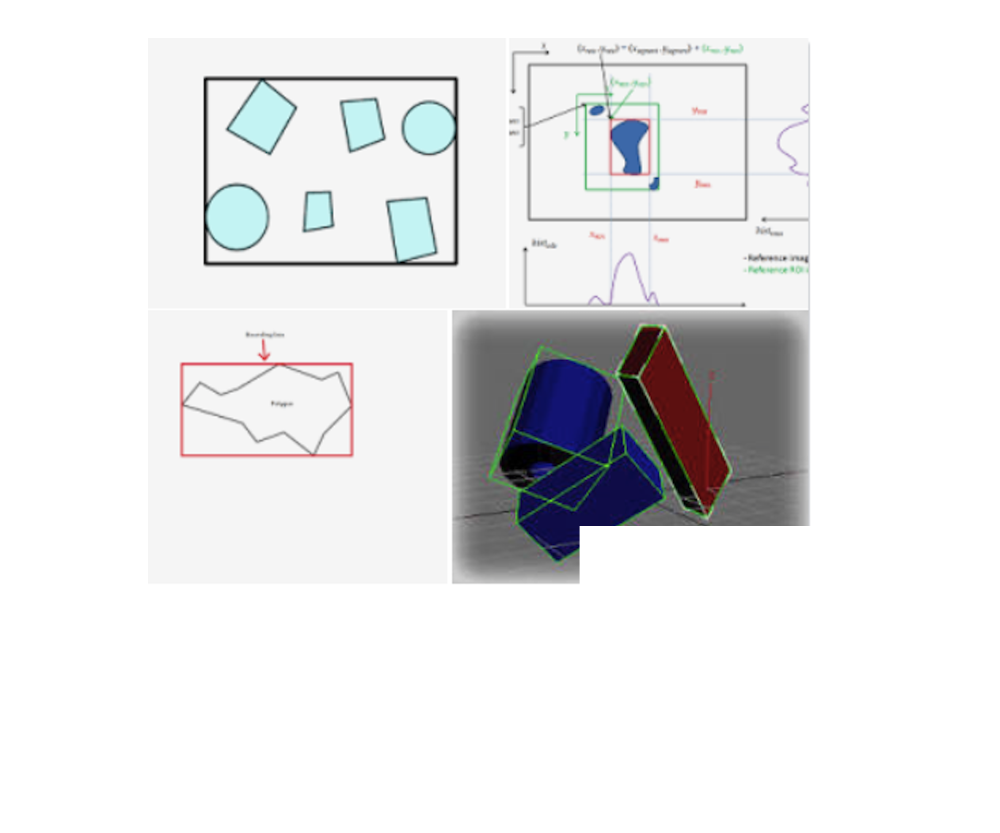

# Bounding Box

Unidade 2 - 7) BBox dos círculos
<https://github.com/dalton-reis/disciplinaCgNot/blob/main/Unidade2/Atividade.md#7-bbox-dos-c%C3%ADrculos>

Dentro da área gráfica, algo de bastante importância: dados e rotinas
<https://pt.wikipedia.org/wiki/Caixa_delimitadora_m%C3%ADnima>

- Pipeline Gráfico: "render" - modelo de dados gráficos e "pintar" na tela - transformar dados gráficos em imagem -> CG
- seleção gráfica: Geometria Computacional

BBox (Bounding Box)

