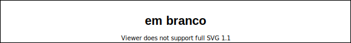

# Computação Gráfica - Unidade 2  

Conceitos básicos de Computação Gráfica: estruturas de dados para geometria, sistemas de coordenadas na biblioteca gráfica (OpenGL/OpenTK), primitivas básicas (vértices, linhas, polígonos, círculos e curvas cúbicas – splines).  

Objetivo: aplicar os conceitos básicos de sistemas de referências e modelagem geométrica em Computação Gráfica.  

## Rabiscos

## Material  

[cg-slides_u2.pdf](./cg-slides_u2.pdf "cg-slides_u2.pdf")  

## [Ambiente de Desenvolvimento](IDE.md "Ambiente de Desenvolvimento")  

## [Atividades - Aula](atividade.md "Atividades - Aula")  

----------

## ⏭ [Unidade 3)](../Unidade3/README.md "Unidade 3")  

<!--
[FIXME: arrumar as fontes bibliográficas]  
## Principais Referências Bibliográficas​
-->