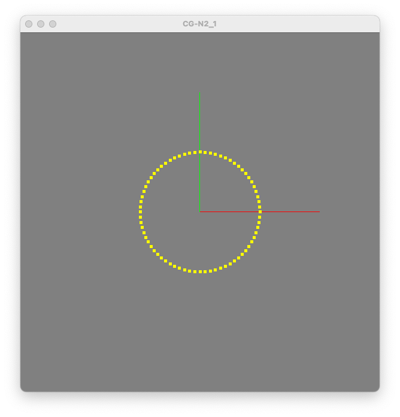
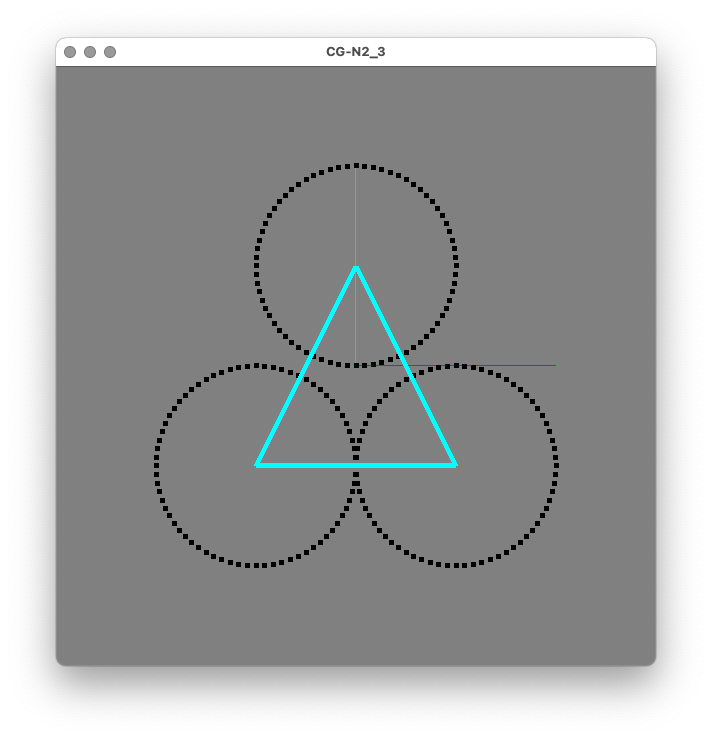
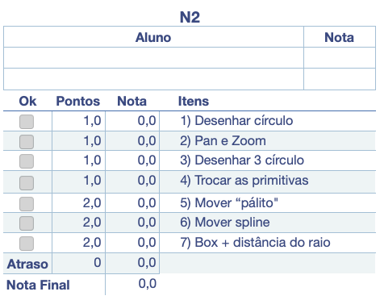

<!-- [@]TODO:INICIO atualizar -->

[CG_Biblioteca]:                   https://github.com/dalton-reis/disciplinaCg_XXXX-X_not_equipe-XX/tree/master/CG_Biblioteca                           "CG_Biblioteca"  
[CG_Biblioteca_BBox]:              https://github.com/dalton-reis/disciplinaCg_XXXX-X_not_equipe-XX/tree/master/CG_Biblioteca/BBox.cs                   "BBox.cs"  
[CG_Biblioteca_CameraOrtho]:       https://github.com/dalton-reis/disciplinaCg_XXXX-X_not_equipe-XX/tree/master/CG_Biblioteca/CameraOrtho.cs            "CameraOrtho.cs"  
[CG_Biblioteca_Cor]:               https://github.com/dalton-reis/disciplinaCg_XXXX-X_not_equipe-XX/tree/master/CG_Biblioteca/Cor.cs                    "Cor.cs"  
[CG_Biblioteca_Matematica]:        https://github.com/dalton-reis/disciplinaCg_XXXX-X_not_equipe-XX/tree/master/CG_Biblioteca/Matematica.cs             "Matematica.cs"  
[CG_Biblioteca_Ponto4D]:           https://github.com/dalton-reis/disciplinaCg_XXXX-X_not_equipe-XX/tree/master/CG_Biblioteca/Ponto4D.cs                "Ponto4D.cs"  
[CG_Biblioteca_CameraPerspective]: https://github.com/dalton-reis/disciplinaCg_XXXX-X_not_equipe-XX/tree/master/CG_Biblioteca/CameraPerspective.cs      "CameraPerspective.cs"  
[CG_Biblioteca_Transformacao4D]:   https://github.com/dalton-reis/disciplinaCg_XXXX-X_not_equipe-XX/tree/master/CG_Biblioteca/Transformacao4D.cs        "Transformacao4D.cs"  

[CG_N2]:                   https://github.com/dalton-reis/disciplinaCg_XXXX-X_not_equipe-XX/tree/master/unidade_2/CG_N2                                 "CG_N2"  
[CG_N2_Mundo]:             https://github.com/dalton-reis/disciplinaCg_XXXX-X_not_equipe-XX/tree/master/unidade_2/CG_N2/Mundo.cs                        "Mundo.cs"  
[CG_N2_Objeto]:            https://github.com/dalton-reis/disciplinaCg_XXXX-X_not_equipe-XX/tree/master/unidade_2/CG_N2/Objeto.cs                       "Objeto.cs"  
[CG_N2_ObjetoGeometria]:   https://github.com/dalton-reis/disciplinaCg_XXXX-X_not_equipe-XX/tree/master/unidade_2/CG_N2/ObjetoGeometria.cs              "ObjetoGeometria.cs"  
[CG_N2_Retangulo]:         https://github.com/dalton-reis/disciplinaCg_XXXX-X_not_equipe-XX/tree/master/unidade_2/CG_N2/Retangulo.cs                    "Retangulo.cs"  
[CG_N2_Utilitario]:        https://github.com/dalton-reis/disciplinaCg_XXXX-X_not_equipe-XX/tree/master/unidade_2/CG_N2/Utilitario.cs                   "Utilitario.cs"  
[CG_N2_DC]:                https://github.com/dalton-reis/disciplinaCg_XXXX-X_not_equipe-XX/tree/master/unidade_2/CG_N2/svg/plantuml/CG_N2_Completo.svg "Diagrama de Classe CG_N2"  

# Unidade 2: OpenGL (OpenTK) - atividade  

Lembretes:

- cada questão deste trabalho deve ser separada em novas pastas e projetos executados separadamente. Obrigatoriamente devem usar as classes disponível no exemplo: [CG_N2]. Então estude com muita **atenção** as classes da [CG_Biblioteca]: [CG_Biblioteca_BBox], [CG_Biblioteca_CameraOrtho], [CG_Biblioteca_Cor], [CG_Biblioteca_Matematica], [CG_Biblioteca_Ponto4D]. E do exemplo [CG_N2]: [CG_N2_Mundo], [CG_N2_Objeto], [CG_N2_ObjetoGeometria], [CG_N2_Retangulo], [CG_N2_Utilitario]. As Classes [CG_Biblioteca_CameraPerspective] e [CG_Biblioteca_Transformacao4D] só serão usadas na Unidade 3, então não use elas por enquanto.  
- olhem a especificação das classes em: [CG_N2_DC].  
- usem a pasta Unidade2 do GitHub da sua equipe para criar as novas pastas dos projetos e desenvolver/entregar o seu código.  

## 1. Explorar o uso da primitiva gráfica ponto no SRU  

Implemente uma aplicação para desenhar um círculo no centro do Sistema de Referência do Universo (SRU), com raio de valor 100. Utilize 72 pontos simetricamente distribuídos sobre o perímetro do círculo e defina as dimensões da janela do espaço gráfico com valores entre -300 a 300, de forma que o resultado final seja o mais parecido com a figura a baixo. Neste caso crie uma nova classe com o nome ```Circulo``` em ```Circulo.cs```.  

  

Observações:  

- desenhe somente os eixos positivos x e y, cada um com comprimento igual a 200;  
- experimente mudar a cor de fundo da tela para cinza e a cor de desenho dos pontos para amarelo;  
- utilize as funções sin(ang) e cos(ang) da Classe [CG_Biblioteca_Matematica] fornecida;  
- não é permitido usar o comando circle do OpenGL e nem outra implementação que não use as funções da classe [CG_Biblioteca_Matematica].  

## 2. Funções de Pan e Zoom  

Crie uma nova aplicação (ver vídeo abaixo) usando como base o exercício anterior (neste caso o fundo de cor branca e desenho preto) para implementar as funções de Pan e Zoom. Para isso implemente uma função de callback de teclado que leia as teclas e os parâmetros necessários para a função Ortho. Tais parâmetros deverão (se já não estão) ser armazenados em uma classe [CG_Biblioteca_CameraOrtho].  

Observações:  

- tecla Pan (deslocar para esquerda): E;  
- tecla Pan (deslocar para direita): D;  
- tecla Pan (deslocar para cima): C;  
- tecla Pan (deslocar para baixo): B;  
- tecla Zoom in (aproximar): I;  
- tecla Zoom out (afastar): O.  

Não esqueça de “tratar” os limites de zoom mínimo e máximo senão poderá ocorrer erros de execução, ou até a inversão horizontal/vertical do desenho na tela. Geralmente estes “problemas” ocorrem devido ao tipo de variável declarada para armazenar o “passo” do zoom atual. Lembre de usar a classe ```Circulo``` criada no exercício anterior.  

  

## 3. Desenhando objetos gráficos iguais  

Crie uma outra aplicação para fazer o desenho da imagem abaixo. Os círculos tem raio com valor 100. Aqui utilize a classe ```Circulo``` já criada e crie uma nova classe com o nome ```SegReta``` em  ```SegReta.cs``` para desenhar o triângulo definido por três segmentos de reta. Utilize a operação soma para deslocar o centro das circunferências para as posições apresentadas na imagem abaixo. Esta soma não deve ser feita na classe [CG_Biblioteca_Matematica], e sim ser informada no momento que for criado o novo objeto do tipo ```Circulo```, passando um [CG_Biblioteca_Ponto4D] de deslocamento (ptoCentro).  

  

## 4. Primitivas Geométricas  

Nesta aplicação a ideia é explorar a utilização das “primitivas geométricas”. As dimensões da janela do espaço gráfico deve ter valores entre -400 a 400. Já os pontos são valores de 200 negativo e positivo de forma que o resultado final seja o mais parecido com o vídeo a baixo.  

No caso a interação deve ser:  

- para alternar entre as “primitivas geométricas” use a tecla de “barra de espaço”;  
- as “primitivas geométricas” que devem ser utilizadas são: Points, Lines,  LineLoop,  LineStrip,  Triangles,  TriangleStrip, TriangleFan,  Quads, QuadStrip e Polygon.  

**Atenção**: só deve aparecer em todo o código UM ÚNICO ```glBegin``` e ```glEnd``` para informar as primitivas geométricas. As imagens abaixo são meramente ilustrativas de só algumas das “primitivas”, e não precisam aparecer na mesma sequência.  

  

## 5. Sr. Palito, dando seus primeiros passos  

Agora, crie uma nova aplicação com o objetivo de poder mover um Segmento de Reta (SR), aqui conhecido com Sr. "Palito", lateralmente usando as teclas Q (esquerda) e W (Direita). Ao iniciar a aplicação um dos pontos do Sr. Palito está na origem. O segundo ponto do Sr. Palito será definido com raio de valor 100 e ângulo 45º. Ainda é possível usar as teclas A (diminuir) e S (aumentar) para mudar  o tamanho (raio), e as teclas Z (diminuir) e X (aumentar) para girar (ângulo) do Sr. Palito. Olhe o exemplo no vídeo a baixo. Lembre de usar a classe ```SegReta``` já definida no exercício anterior para desenhar o Sr. Palito.  

Ah ... o Sr. Palito não se parece muito com o "desenho" do segmento de reta que representa um raio de uma circunferência !!  

  

## 6. Spline  

Já esta aplicação o seu objetivo é poder desenhar uma spline (curva polinomial) que permita alterar a posição (x,y) dos pontos de controle dinamicamente utilizando o teclado. As dimensões da janela com valores (xMin: -400, xMax: 400, yMin: -400, yMax: 400) e os pontos são valores de 100 negativo e positivo de forma que o resultado final seja o mais parecido com o vídeo a baixo.  

No caso a interação deve ser:  

– para mudar entre o ponto de controle selecionado (em cor vermelha) usar as teclas “1, 2, 3 e 4”;  
– para mover o ponto selecionado (um dos pontos de controle) usar as teclas C (cima), B (baixo), E (esquerda) e D (direita);  
– as teclas do sinal de mais (+) e menos (-) podem aumentar e diminui a quantidade de pontos calculados na spline;  
– ao pressionar a tecla R os pontos de controle devem voltar aos valores iniciais;  
– a spline deve ser desenha usando linhas de cor amarela;  
– o poliedro de controle deve ser desenhado usando uma linha de cor ciano.  

**ATENÇÃO**: não é permitido usar o comando spline do OpenGL, sendo só permitido usar UMA das formas de splines “demonstradas em aula”. Ao mover um dos pontos de controle, o poliedro e a spline deve se ajustar aos novos valores deste ponto.  
Veja o exemplo no vídeo a baixo.  

Use a classe ```SegReta``` para desenhar o poliedro de controle e crie uma nova classe para representar o objeto gráfico Spline em ```Spline.cs```.  

  

## 7. BBox dos círculos

E por fim, esta aplicação tem o objetivo de fazer um joystick virtual. Basicamente deve-se desenhar dois círculos (um menor e outro maior) e poder usar o mouse para mover o círculo menor, mas sem deixar ele (o centro do círculo menor) sair dos limites do círculo maior.  

Para controlar o movimento do centro do círculo menor deve ser usado:  

– um teste inicial pela BBox interna do círculo maior;  
– seguido do cálculo da distância (euclidiana, sem raiz).  

  ^2+(y_{2}-y_{1})^2})  

Exemplo, vídeo a baixo.  

Aqui só use as classes [CG_N2_Retangulo] e ```Circulo``` para fazer as representações dos objetos abaixo. E não esqueça de usar o código da classe [CG_Biblioteca_BBox].  

  

## Atenção

A avaliação da atividade envolve o desenvolvimento das questões acima apresentadas, mas o mais importante é o integrante da equipe demonstrar conhecimento além do código desenvolvido, também os conceitos apresentados em aula relacionados com a atividade em si.

## Gabarito

  

----------

## ⏭ [Unidade 3)](../Unidade3/README.md "Unidade 3")  
